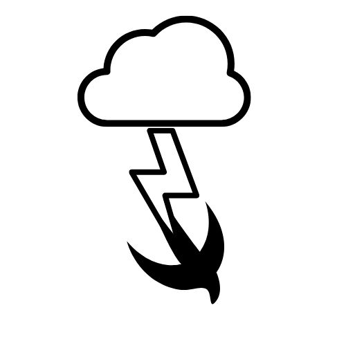

 [](https://codebeat.co/projects/github-com-jzdesign-transfer-main) [](https://github.com/apple/swift-package-manager) [](https://github.com/JZDesign/Transfer/blob/master/LICENSE) [](https://jzdesign.github.io/Transfer/)

<div style="float: none;"><div style="float:left;">
<h1>Transfer</h1>
<p style="max-width:300px;">Swifty Server Side HTML generation & templating in Swift
</p>
</div>
</div>


## SPM 

```swift
dependencies: [
    .package(url: "https://github.com/JZDesign/Transfer.git", .upToNextMajor(from: "0.01.0"))
],
```

## Usage

A simple overview

```swift
let head = Head(
        title: "Title", 
        headContent: .styleSheet("styles/someThing.css"), .favicon()
    )

Page(head: head)
    .rendered(withBody: 
        .h1("This is your title"),
        .div(someDivContent, cssClass: "container")
        )
```


