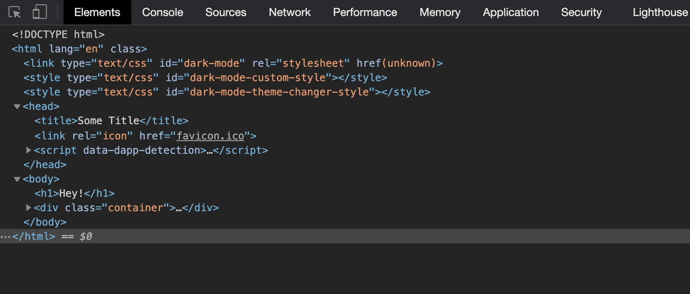

 [](https://codebeat.co/projects/github-com-jzdesign-transfer-main) [](https://github.com/apple/swift-package-manager) [](https://github.com/JZDesign/Transfer/blob/master/LICENSE) [](https://jzdesign.github.io/Transfer/)


## SPM 

```swift
dependencies: [
    .package(url: "https://github.com/JZDesign/Transfer.git", .upToNextMajor(from: "0.01.0"))
],
```

## Usage

### A simple overview

```swift
let head = Head(
        title: "Title", 
        headContent: .styleSheet("styles/someThing.css"), .favicon()
    )

Page(head: head)
    .rendered(withBody: 
        .h1("This is your title"),
        .div(someDivContent, cssClass: "container")
        )
```




### Using Transfer in a [Vapor](https://github.com/vapor/vapor) project

This package intentionally has no dependencies, and therefore does not wrap anything for convenience in Vapor. To use Transfer with Vapor, add this extension to your project.

```swift
import Vapor

extension Request {
    func transfer(_ html: String) -> EventLoopFuture<Response> {
        eventLoop.makeSucceededFuture(Response(status: .ok, headers: HTML_CONTENT_HEADER, body: Response.Body(string: html)))
    }
}
```

Then you can render a page like:

```swift
// in Routes.swift

app.get("site") {
        $0.transfer(
            Page(head: Head(title: "Some Title", headContent: [])).rendered("<h1>Hey!</h1>")
        )
    }
```
